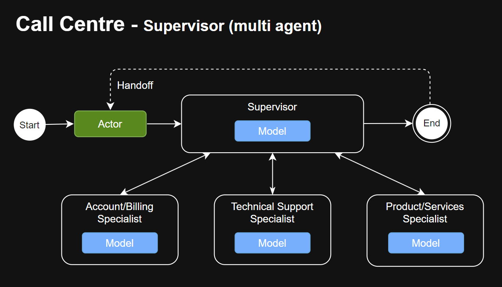
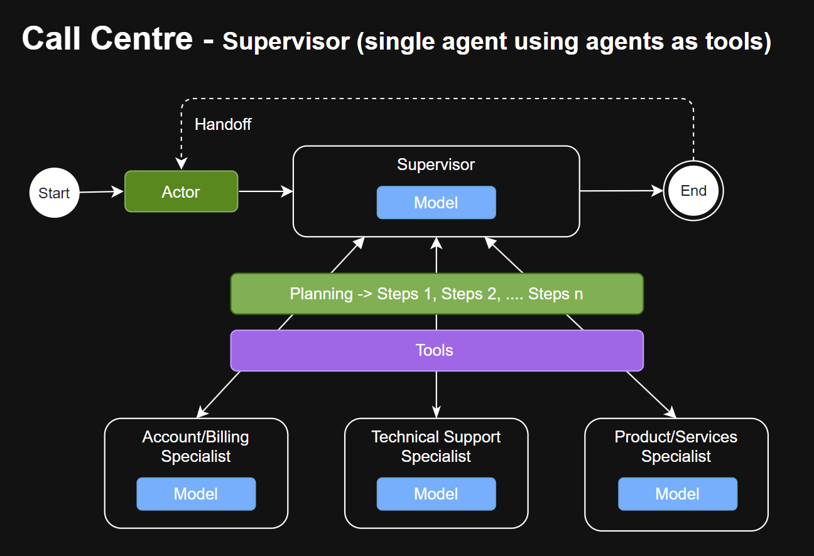

# Agentic AI Design Patterns

This repository showcases a collection of simple agents designed to demonstrate various design patterns in `Agentic AI` driven workflows. Each pattern is implemented with practical examples and detailed explanations to help developers and researchers understand and apply these concepts effectively in their projects.

To keep things simple and to reduce unnecessary complexity, the examples will minimize framework dependencies. We've chosen [Pydantic AI](https://ai.pydantic.dev/) for our agentic AI development as it is both lightweight and provides the essential building blocks for building production-quality `Agentic AI workflows`

All use cases (except for a couple) leverages [Pydantic Graphs](https://ai.pydantic.dev/api/pydantic_graph/graph/) to manage agentic workflows. Using `graph-based workflows` from the outset is a good **best practice** for several reasons:

- Most agentic workflows involve multiple agents. A graph-based workflow approach provides a consistent foundational pattern, making it easier to understand and maintain across the development team.  
- Introducing graph-based workflows early in the SDLC makes it significantly easier when extensibility and refactoring are required.

### Considerations

#### Use-Cases  
The example scenarios in this repository are contrived and intentionally constructed for simplicity. The goal is to eliminate unnecessary distractions from complicated use-cases and focus purely on the topics at hand - **AI Agentic Design Patterns**.

#### Disclaimer  
I come from a C# background, so my Python skills may not be perfect. Suggestions for improvements are always welcome!


## Design Patterns Covered

This section highlights various design patterns commonly used in agentic AI development. For a deeper understanding of why and when to apply a particular design pattern, refer to the following articles:
- [Building effective agents](https://www.anthropic.com/research/building-effective-agents)
- [Multi-agent Systems](https://langchain-ai.github.io/langgraph/concepts/multi_agent/)

### [Fully Autonomous](design_patterns/full_autonomous) - Single Agent with Tools (non-graph)
- Demonstrates how a single agent can seamlessly integrate with third-party tools, such as Asana, to automate project and task management. The agent's model is allowed to operate **Full Autonomously**, provided it has the appropriate tools to perform its tasks effectively.
- Features:
  - Fully autonomous operation (planning)
  - Tool calling 
  - chat history (memory)
  - Console app (with streaming) 
  - Streamlit app (with streaming)  
- Workflow
<p style="margin-left: 40px;">
  
</p>  

**Note**: For sake of demonstration, the Asana API is a mock and utilizes _sqlite_ to maintain states i.e. Projects and Tasks

### [Prompt Chaining Workflow](design_patterns/prompt_chaining)
- Demonstrates how to use prompt chaining - taking part or in whole, the response of a previous agent and using it as input to the next agent in the chain.
- Use-case: 
  - Obtain a validate city from the user. If a valid city was not provided, the end and with no results.
  - Once a validate city was provided, get details about the city i.e. Regional information and a summarized history about the city. 
  - **Note**: Obviously, this use-case can be achieved using a single agent with a **one-shot** prompt. As stated before, the objective is to demonstrate the design pattern and keeping the use-case as simple as possible for demonstration purposes.
- Features:
  - Multi-Agent
  - Graphs
  - States
  - Result Type
  - Prompt Chaining
  - Console app
- Workflow
<p style="margin-left: 40px;">
  
</p>

### [Supervisor](design_patterns/supervisor) - Multi-Agent
- Demonstrates how to build a call center chat application using a Supervisor-based multi-agent design pattern. This approach aligns well with the Single Responsibility Principle (SRP), ensuring each agent has a clear, focused role.
- Use Case:
  - Develop a chat application that allows users to ask general questions, whether or not 
    they  are related to the company's services.  
  - The Supervisor agent receives the initial user query and determines the 
    appropriate Specialist to handle it.
  - If no Specialist can address the request, the Supervisor responds to the user politely.
  - If a Specialist can handle the request, it processes the response and sends it back to the Supervisor, completing the interaction graph cycle.
- Features:
  - Multi-Agent
  - Graphs
  - States
  - Chat history (memory)
  - Result Type    
  - Console app
- Workflow
<p style="margin-left: 40px;">
  
</p>


### [Supervisor](design_patterns/supervisor) - Single Agent using other Agents as Tools (non-graph)

- Demonstrates how to build a call center chat application using a Supervisor-based single-agent design pattern, using agents as tools within its reasoning cycle. This approach is similar to the Fully Autonomous agent mentioned earlier.
- Use Case:
  - Develop a chat application that allows users to ask general questions, regardless of whether they relate to the company's services.
  - The Supervisor agent receives the user's query and formulates a plan of action to provide an appropriate response.
  - Leverage Specialist tools (agents) as needed to process and address the user's request effectively.
- Features:
  - Supervisor (planning)
  - Tool calling (via agents)
  - Chat history (memory)
  - States  
  - Console app (with streaming) 
- Workflow
<p style="margin-left: 40px;">
  
</p>

## WORK IN PROGRESS SUBJECT TO CHANGE


#### Routing Parallelization (Supervisor Role)
- Similar to the routing workflow, but tasks are distributed and processed in parallel by multiple sub-agents.

#### Orchestrator-Workers Workflow (Supervisor Role)
- An orchestrator agent coordinates multiple worker agents to perform tasks collaboratively, ensuring dependencies are resolved and tasks are completed efficiently.

#### Evaluator-Optimizer Workflow
- An evaluator agent assesses the output of other agents and provides feedback, which is then used by an optimizer agent to improve results iteratively.

#### Human-in-the-Loop (HITL) Workflow
- Combines agent autonomy with human oversight, allowing humans to review, validate, or intervene in the agent's decision-making process.

#### Long-Running with HITL Workflow - Hydrating/Dehydrating
- Enables agents to handle long-running tasks with intermittent human interactions, while maintaining state persistence through hydration (storing state) and dehydration (resuming state).

## How to Use
1. Clone this repository: 
   ```bash
   git clone https://github.com/codematrix/agent-design-patterns.git
   ```
2. Explore each design pattern example in the respective directories.

### Requirements
- Python 3.13.1
- Required libraries listed in `requirements.txt`

Install the dependencies:
```bash
pip install -r requirements.txt
```

### Create and update the **.env** file

We provided a sample **.env.readme** file. Please copy and create your own **.env** file and update the values using your API keys. 
If you use different model providers, then make sure to update agents used in the examples. 
If you're not using **logfire**, you can exclude those key/value pairs.

## Contributing
Contributions are welcome! Please open an issue or submit a pull request to suggest improvements or add new design patterns.

## License
This project is licensed under the MIT License. See the `LICENSE` file for details.
